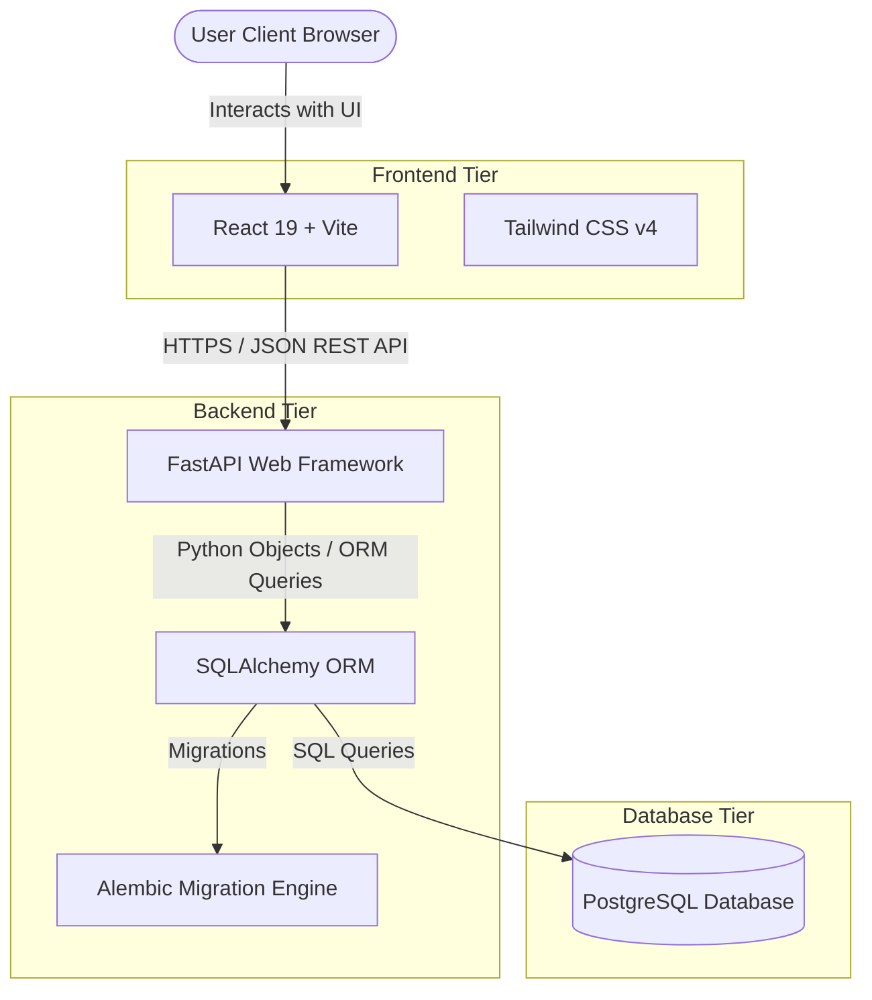

# AssetFlow

### Enterprise Asset & Resource Management System

AssetFlow is a centralized ERP platform designed to help organizations track, allocate, and maintain their physical assets and shared resources. By replacing scattered spreadsheets, paper logs, and disparate emails, AssetFlow provides a single, reliable source of truth.

It is built for any organization—such as offices, schools, hospitals, factories, or agencies—that manages equipment, furniture, vehicles, or shared spaces, and requires real-time visibility into asset location, allocation, and condition.

---

## 🏗️ Architecture Diagram

The system employs a classic client-server architecture with role-based access control and a relational database.

---

## 🛠️ Tech Stack

### Frontend
- **React (v19)**: Component-based UI library.
- **Vite (v8)**: Ultra-fast frontend build tool and dev server.
- **Tailwind CSS (v4)**: Utility-first CSS styling framework.
- **React Router Dom (v7)**: SPA client-side routing.
- **Axios**: Promise-based HTTP client for API communication.
- **Lucide React**: Modern, clean icon library.

### Backend & Database
- **FastAPI**: Modern, high-performance web framework for building APIs with Python.
- **SQLAlchemy**: Feature-rich SQL toolkit and Object-Relational Mapper (ORM).
- **Alembic**: Database migration tool for SQLAlchemy.
- **PostgreSQL**: Robust, enterprise-grade relational database management system.
- **Pydantic (v2)**: Data validation and settings management using Python type annotations.

---

## ✨ Features Explained

- **Asset Lifecycle Tracking**: Every physical asset is tracked through its entire lifecycle (Available, Allocated, Reserved, Under Maintenance, Lost, Retired, Disposed), maintaining a complete audit trail of state changes.
- **Conflict-Free Asset Allocation**: Streamlines the process of assigning assets to employees or departments. The system validates availability in real time, blocks double-allocations, and routes overlapping requests through structured transfer workflows.
- **Overlap-Free Resource Booking**: Manages shared resources like conference rooms, vehicles, or specialized equipment by time slots, enforcing strict validation to prevent scheduling conflicts.
- **Approval-Gated Maintenance Workflows**: Employees can report faulty assets or raise repair requests. Requests undergo an approval pipeline by Asset Managers, automatically updating asset status to *Under Maintenance* and back to *Available* upon resolution.
- **Structured Audits & Discrepancies**: Allows administrators to schedule audit cycles, assign auditors, verify physical assets, and automatically generate discrepancy reports for unresolved items.
- **Real-Time Dashboards & Alerts**: Provides a unified KPI dashboard with activity logs, notifying administrators and users of overdue returns, upcoming bookings, and pending maintenance tasks.
- **Role-Based Access Control (RBAC)**: Enforces permission boundaries across four distinct roles:
  - **Admin**: Configures organization structures, departments, asset categories, and system roles.
  - **Asset Manager**: Registers and maintains assets, and handles approvals for allocations, transfers, and maintenance.
  - **Department Head**: Oversees assets and resource scheduling specific to their department.
  - **Employee**: Views allocated assets, schedules resource bookings, and raises maintenance requests.

